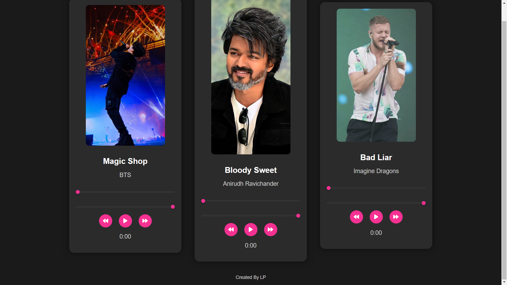

# Simple Music Player

This is a simple music player implemented using HTML, CSS, and JavaScript. It allows users to play music files easily in their web browsers without any additional plugins or software.



## Tech Stack

1. HTML
2. CSS
3. JavaScript

## Live Demo

You can access the live demo of the music player [here](https://lp-the-coder.github.io/Music-player.io/).

## Features

- Play, pause, and stop functionality.
- Control volume.
- Progress bar to visualize the playback progress.
- Ability to skip to the next or previous track.
- Responsive design for compatibility across devices.

## Usage

1. Clone the repository to your local machine:

```
git clone https://github.com/lp-the-coder/Music-player.io.git
```

2. Open `index.html` in your web browser.

3. Add your own music files to the `music` directory and update `songs.js` with the file names and titles.

4. Enjoy listening to your favorite music!

## Screenshots

[Include screenshots of your music player here if applicable]

## Contributing

Contributions are welcome! Feel free to open issues or pull requests for any improvements or bug fixes.

## License

This project is licensed under the MIT License - see the [LICENSE](LICENSE) file for details.

---

Feel free to customize this README according to your project's specific details and requirements.
